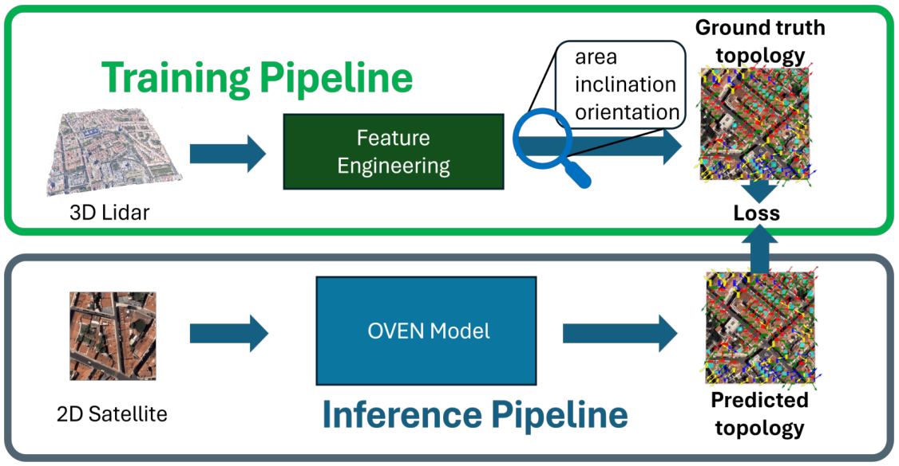
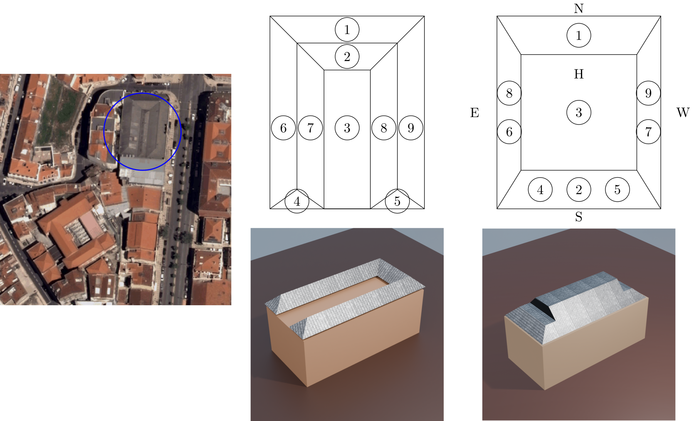

## OVEN 

This project is the implementation of the OVEN framework: a methodology used to extract the topology (area, orientation, inclination) of buildings from satellite images. 

We achieve this by creating a dataset with 3D information and forcing the Deep Neural Network (based on YOLO v11) to learn features that indicate the topology just by observing satellite images.

The basic idea behind this framework is to show a large collection of building topologies, as illustrated here:

Through back-propagation, we teach the network to find reliable estimates of the orientation and inclination of rooftops that can be used for solar panel installation.

To deal with variable building topologies (e.g., varying number of tiles), the deep model is forced to learn how to map buildings of arbitrary shape, as seen in the center of the following figure, into a convex representation, as seen on the right:


# Dataset

The curated dataset can be found in /datasets with images and labels split between training and validation data. 

# How to use

We supply the smallest version of the trained model for Lisbon. Pending request, a larger version can be supplied. To start we assume that you have 

1. A python interpreter > 3.12
2. pip installed in your system

Open a terminal in the folder of OVEN

```bash
>> python -m venv depend
>> source depend/bin/activate
>> (depend) pip install -r requirements.txt
```

If you need to train the model locally, we have a prototypical function that either trains the model or that runs the genetic algorithm to select the optimum hyperparameters to train the model. You can do this through 

```bash
>> (depend) python3 test_training.py
```

Now suppose that you don't want to train the model but want to use it in your application. Note that the algorithm was trained with data from Lisbon, so there is a chance that the predictive power of the model degrades. We make no strong claims about these differences in performance.

 

# Citation

This code accompanies the journal submission of OVEN. If you find this project helpful and useful, please cite our work! It's appreciated!
