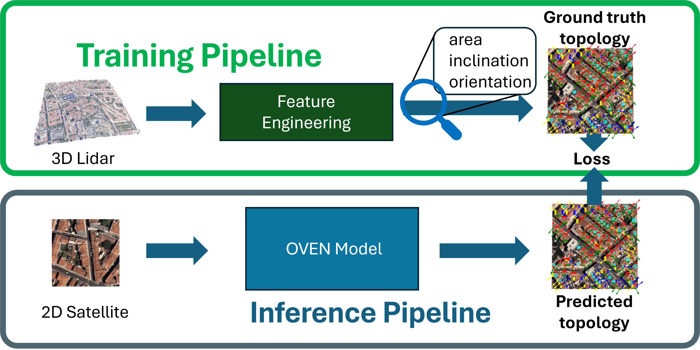

## OVEN 

This project is the implementation of the OVEN framework: a methodology that can be used to extract the topology (area,orientation,inclination) of buildings from satellite images. 
We achieve this by creating a dataset with 3D information, and force the Deep Neural Network, based on a YOLO V11, to learn features that indicate the topology just by
observing satellite images.

The basic idea behind this framework is to show a large collection of building topologies, as illustrated in

and through back-propagation teach the network to find 

# Dataset

The curated dataset can be found in /dataset with images/labels split between training and validation data. 

# Citation

This code acompanies the journal submission of OVEN. If you find this project helpful and useful, please cite our work! It's appreciated!
